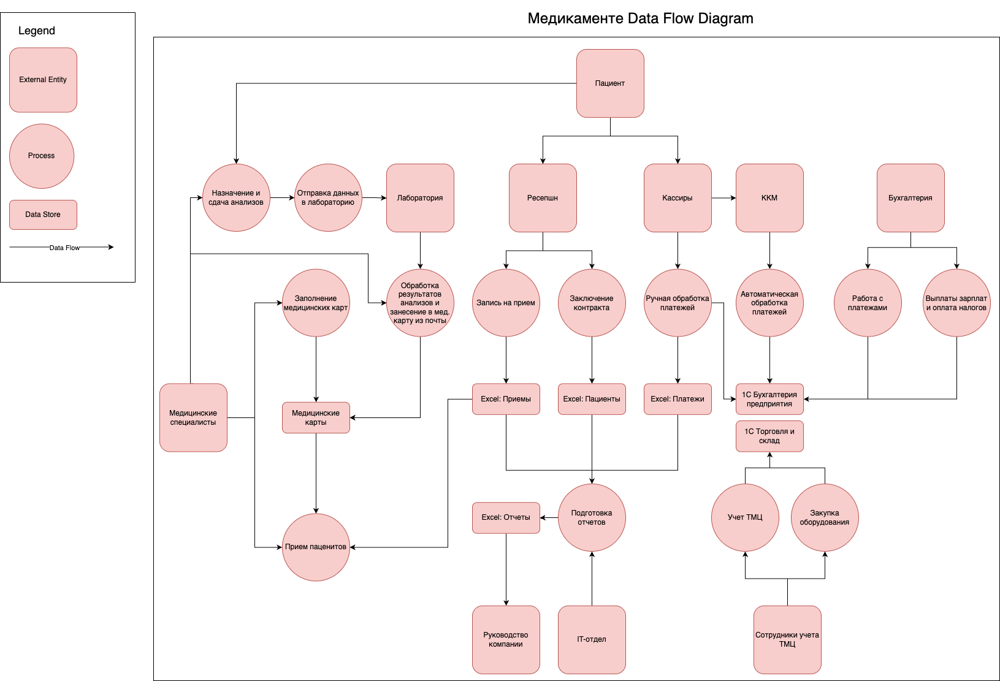

# Хранение и управление данными

- [Хранение и управление данными](#хранение-и-управление-данными)
  - [Data Flow Diagram](#data-flow-diagram)
  - [Аудит мер безопасности и список проблемных зон](#аудит-мер-безопасности-и-список-проблемных-зон)
  - [Рекомендации по улучшению и способы защиты данных](#рекомендации-по-улучшению-и-способы-защиты-данных)
    - [Аудит и мониторинг](#аудит-и-мониторинг)
    - [Сегментация сети](#сегментация-сети)
    - [Шифрование (at rest и in transit)](#шифрование-at-rest-и-in-transit)
    - [Разграничение доступа (RBAC/ABAC)](#разграничение-доступа-rbacabac)
    - [Классификация и маркировка](#классификация-и-маркировка)
    - [Маскирование и анонимизация](#маскирование-и-анонимизация)
    - [Организационные меры](#организационные-меры)
    - [Отказ от Excel-помоек](#отказ-от-excel-помоек)
    - [Резервное копирование](#резервное-копирование)
    - [Многофакторная аутентификация](#многофакторная-аутентификация)

## Data Flow Diagram

## Аудит мер безопасности и список проблемных зон

Анализ того, насколько текущие процессы и архитектура соответствуют требованиям ФЗ-152 («О персональных данных») и общим практикам в области информационной безопасности

1. **Отсутствие аудита действий**: В Excel, PDF и JPG не ведётся журнал (лог) операций. Сотрудники могут открывать и менять файлы без записи истории изменений
2. **Высокий риск ошибок при ручной обработке**: Из-за того, что данные повторно переносятся сотрудниками (из Excel в 1С и обратно), возможны неточности, пропуски и опечатки, приводящие к расхождениям в учёте
3. **Нет явного разграничения прав доступа (RBAC/ABAC)**: Доступ к конфиденциальным файлам (например, с медицинскими картами) регулируется только доменной аутентификацией и бизнес-процессом. Нет формальных запретов, мешающих любому сотруднику компании, имеющему доступ к общим сетевым папкам, открыть не свою таблицу
4. **Внутренние потоки данных не контролируются**: Между 1С, Excel и файловым сервером нет системы контроля потоков, нет DLP-инструментов, нет средств предотвращения утечек
5. **Хранение в незащищённом виде**: Личные данные пациентов (ФИО, паспорт, контакты, мед. информация) и сотрудников (паспортные данные, ЗП) хранятся в открытых Excel-файлах или в виде скан-копий без шифрования
6. **Невозможность быстрой (и централизованной) анонимизации/удаления**: ФЗ-152 обязывает оператора ПДн по запросу субъекта удалить/обезличить данные, но при хранении копий в разных Excel и папках непросто гарантировать полное удаление
7. **Риски от физического размещения сервера в офисе**: Сервер находится в том же здании, отсутствуют дополнительные уровни физической и сетевой безопасности
8. **Недостаточная организационная безопасность**: Нет формальных политик и процедур (Information Security Policy), регламентирующих:
   1. Технологию доступа к PII/PHI
   2. Порядок переноса данных на внешние носители
   3. Маскировку при аналитических выгрузках
   4. Сотрудники не проходят регулярное обучение по безопасной работе с ПДн (phishing, social engineering).
9. **Нет механизма контроля/управления резервным копированием**: Неясно, как организованы бэкапы и на каком носителе они хранятся, есть ли в них шифрование
10. **Отсутствие MFA и строгих требований к паролям**: Нет упоминания использования многофакторной аутентификации (MFA) в критически важных системах (1С, AD). Также, например, пароли могут быть слишком простыми или одинаковыми для нескольких ресурсов.

## Рекомендации по улучшению и способы защиты данных

Меры и инструменты, которые помогут повысить уровень безопасности и соответствовать требованиям ФЗ-152

### Аудит и мониторинг
- Настроить журналы аудита 1С и отправлять логи в SIEM (Splunk, Elastic Stack, ArcSight)
- При нетипичной активности отправлять алерты в мессенджер или на email

### Сегментация сети
- Хранить медданные на отдельном сервере с доступом только у врачей и админов
- Разделить подсети (бухгалтерия, мед, ресепшен) и настроить фаерволы

### Шифрование (at rest и in transit)
- Включить TDE в СУБД или шифровать поля с PII/PHI
- Настроить BitLocker/EFS на серверах Windows
- Использовать TLS для веба, почты и 1С

### Разграничение доступа (RBAC/ABAC)
- Создать роли (Врач, Кассир, Бухгалтер и тд) с доступом только к нужным данным
- Учитывать атрибуты (врач видит карты только своих пациентов)

### Классификация и маркировка
- Присваивать метки (PII, PHI, FIN) и хранить чувствительные данные только в зашифрованном виде
- Использовать DLP или контент-анализ для автотегирования

### Маскирование и анонимизация
- Маскировать телефоны (последние 4 цифры) и ЗП (только диапазоны)
- Хранить ФИО в виде ID, передавая внешним подрядчикам обезличенные данные

### Организационные меры
- Обучать сотрудников защите данных и ответственности за утечки
- Ограничить передачу паролей и использование личных носителей
- Регулярно проверять логи, доступы и проводить тесты на проникновение

### Отказ от Excel-помоек
- Перевести процессы в единую CRM/медсистему
- Уменьшить выгрузки и дубли, удалить старые файлы с общих дисков

### Резервное копирование
- Шифровать бэкапы и хранить ключи отдельно
- Тестировать восстановление и следить за целостностью копий

### Многофакторная аутентификация
- Включить MFA для критических систем (админов AD, 1С, почтового сервера)
- Использовать OTP, аппаратные ключи или push-уведомления