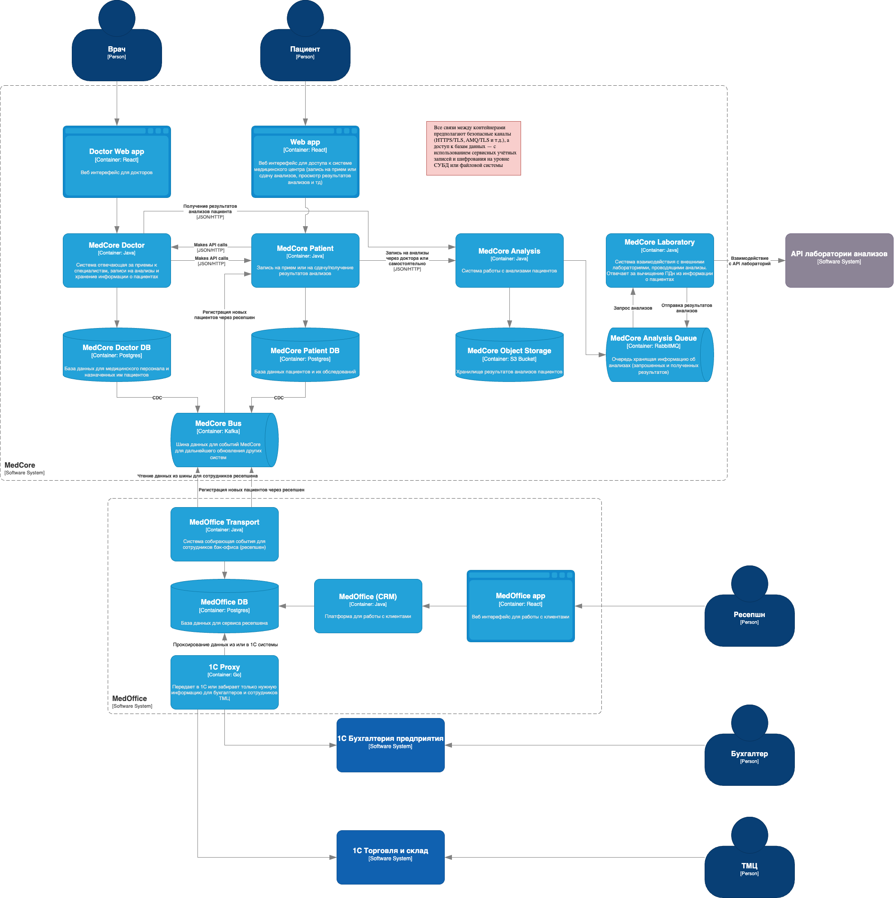
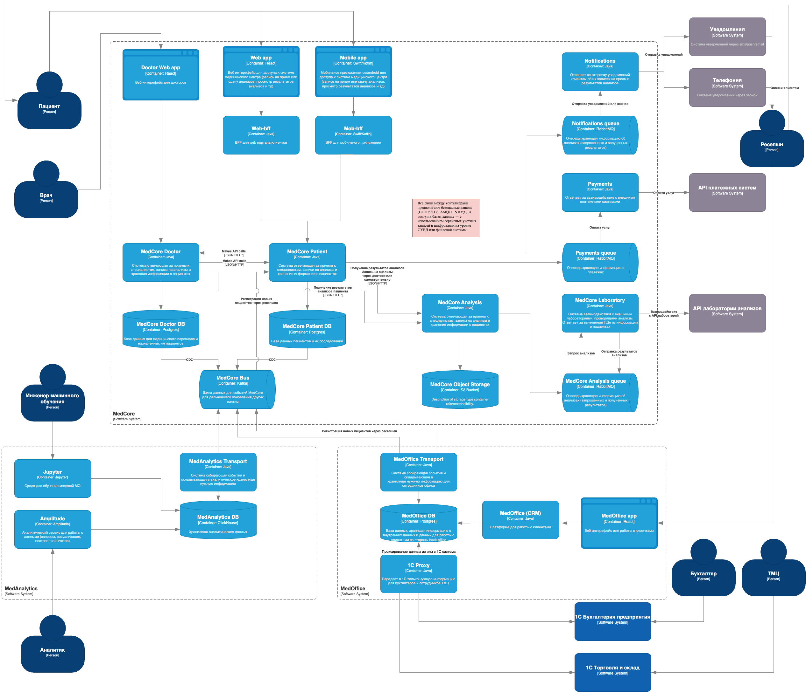

# Решение To-Be

- [Решение To-Be](#решение-to-be)
  - [Диаграма контейнеров: MVP (2-4 месяца)](#диаграма-контейнеров-mvp-2-4-месяца)
  - [Диаграма контейнеров: финальное состояние (12-14 месяцев)](#диаграма-контейнеров-финальное-состояние-12-14-месяцев)
  - [Принципы и особенности работы с данными](#принципы-и-особенности-работы-с-данными)

## Диаграма контейнеров: MVP (2-4 месяца)

## Диаграма контейнеров: финальное состояние (12-14 месяцев)

## Принципы и особенности работы с данными

1. **Доступ к данным MedCore Patient DB осуществляется только по RBAC**
   - У каждой роли (врач, администратор, ресепшен, кассир и т.д.) есть четко прописанные права
   - Доступ к чувствительным полям (паспорт, телефон, результаты анализов) контролируется на уровне атрибутов (ABAC), чтобы, например, один врач не мог просматривать данные другого врача без необходимости

2. **Взаимодействие между MedOffice и ядром (MedCore) идет через Transport**
   - MedOffice Transport запрашивает у MedCore Patient только минимально необходимый набор данных (принцип наименьших привилегий)
   - При передаче данных в UI (например, телефон, номер карты) происходит маскирование или обфускация, если это не критично для бизнес-процесса

3. **Возможность отзыва персональных данных**
   - Пациент через Web app может в любой момент подать запрос на удаление/обезличивание своих данных
   - Система (через MedCore Bus или специальный сервис управления ретенцией) обходит соответствующие базы (MedCore Patient, MedOffice DB) и удаляет/обезличивает записи в течение регламентированного срока (с учетом требований бухучета и иных законов)

4. **Разделение данных о результатах анализов**
   - Данные о результатах анализов хранятся и обрабатываются в MedCore Analysis и MedCore Laboratory
   - При хранении результатов в MedCore Object Storage осуществляется шифрование на уровне объектов (например, AES-256)
   - Доступ к файлам происходит по временным токенам, которые автоматически истекают, и каждый запрос логируется

5. **Безопасная передача данных**
   - Все сервисы обмениваются данными по защищенным протоколам (TLS 1.2+)
   - Для очередей (RabbitMQ/Kafka) тоже настраивается TLS, а при необходимости конфиденциальности содержимого — шифрование payload (JWE или аналог)

6. **Доступ в CRM (MedOffice app) по принципу минимальных привилегий**
   - Ресепшен видит только список ближайших записей (ФИО+ID пациента), без медицинских подробностей
   - Кассиры не имеют доступа к диагнозам или результатам анализов (только оплата и статус договора)
   - Бухгалтерия имеет доступ к финансовым и кадровым модулям, но не к истории болезни

7. **Минимизация ручных операций**
   - Все ключевые процессы (запись, подтверждение оплаты, печать договора) автоматизированы
   - Сотрудник ресепшена лишь вносит основную информацию в MedOffice app — дальше все дублируется через Transport в MedCore при необходимости
   - Таким образом, снижается риск ошибок и утечек при ручном копировании данных

8. **Маскирование и аудит в MedCore Laboratory**
   - При направлении данных во внешнюю лабораторию (через MedCore Analysis Queue) детальные персональные данные заменяются на анонимный идентификатор
   - Лаборатория получает только техданные, необходимые для анализа (например, Пациент #12345, дата рождения ХХ.ХХ.XXXX, тип анализа), ФИО и контакты не передаются
   - При выгрузке результатов обратно в MedCore Laboratory все действия логируются, Auditing-сервис отслеживает нетипичные операции

9. **Многофакторная аутентификация (MFA)**
   - Для сотрудников внутренних систем (врачи, бухгалтерия, склад) включена двухфакторная аутентификация
   - Пациентам может быть предложен второй фактор (например, SMS-код) при доступе к особо чувствительным данным (мед карта)

10. **Периоды и условия уничтожения**
    - Конфиденциальные данные (ФИО, паспорт, результаты анализов) хранятся не дольше, чем это требуется законодательством (медицинские данные — в соответствии с приказами Минздрава, бухгалтерские — в соответствии с налоговым кодексом)
    - По завершении сроков архивирования или при получении запроса об удалении (и если нет законных оснований для дальнейшего хранения) данные уничтожаются физически (delete + wipe) либо обезличиваются (замена полей на специальный шаблон)

11. **Возможность дальнейшего развития (data flow management, тегирование)**
    - В будущем в систему планируется внедрить модуль Data Catalog (или Apache Atlas, Collibra и т.д.) для автоматического тегирования персональных (PII/PHI) и финансовых данных (FIN)
    - При появлении новых сервисов или интеграций они автоматически должны соответствовать политикам шифрования, маскирования и ретенции в соответствии с установленными тегами данных