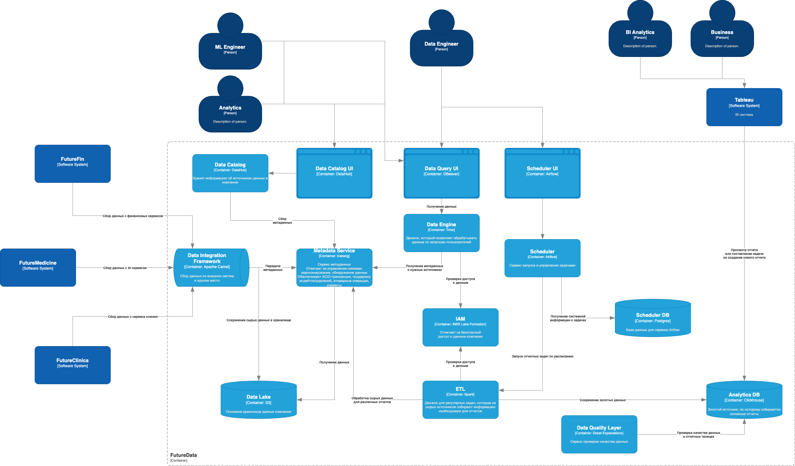

# Обновление DWH
- [Обновление DWH](#обновление-dwh)
  - [Архитектура системы через год](#архитектура-системы-через-год)
  - [Проблемные места и приоритизация](#проблемные-места-и-приоритизация)

## Архитектура системы через год
Компания переходит от централизованного и перегруженного DWH на SQL Server к более гибкой и масштабируемой архитектуре Data Lakehouse. Новая система предполагает:
- Хранение данных в Data Lake (на S3) с последующей организацией слоя Lakehouse — для поддержки ACID-свойств, версионирования, schema evolution и унифицированного доступа
- Разделение на домены (Data Mesh), где каждая команда (клиники, ИИ, финтех и другие) владеет своими данными как продуктом: отвечает за их качество, описание, SLA и доступ
- Data Catalog и Metadata Service позволяют находить и использовать данные, повышая прозрачность и управляемость
- Платформа интеграции данных обеспечивает сбор, стандартизацию и передачу данных в единый Lakehouse-слой, избавляя DWH от роли бутылочного горлышка
- ETL/ELT пайплайны строятся вокруг Lakehouse, а не DWH, ускоряя time-to-market
- Пользователи BI и аналитики получают доступ к витринам данных напрямую из Lakehouse, не нагружая DWH и не дожидаясь ручных выгрузок

## Проблемные места и приоритизация

| #  | Проблема                                                                 | Пояснение                                                                                                                                         | Приоритет |
|----|--------------------------------------------------------------------------|----------------------------------------------------------------------------------------------------------------------------------------------------------------------------------|-----------|
| 1  | Устаревшая архитектура DWH (SQL Server 2008)                             | Сервер не справляется с ростом объёма данных. Каждый новый отчёт может замедлить всю систему. Тяжело масштабировать и дорого поддерживать                                    | Высокий |
| 2  | Нет единой точки доступа к данным                                        | Данные разбросаны между системами. BI-аналитикам сложно собирать дэшборды из разных источников. Повышает time-to-market и снижает гибкость бизнес-решений                     | Высокий |
| 3  | Нет стандартов форматов и структур данных между системами               | Подразделения (клиники, ИИ, финтех) обмениваются данными в произвольном виде: Excel, JSON, нестандартизированные CSV и т.п. Это усложняет автоматизацию, интеграцию и поддержку | Высокий |
| 4  | Отсутствие управления данными (Data Governance, Data Catalog)           | Никто не знает, какие данные есть в компании, кто за них отвечает и как их использовать. Нет описаний, владельцев, документации, политик доступа. Это снижает доверие к аналитике и мешает использовать данные повторно | Средний |
| 5  | Текущая архитектура не позволяет быстро интегрировать новые бизнесы     | Чтобы подключить нового поставщика или бизнес, приходится модифицировать логику в DWH. Это медленно и дорого                                                                 | Средний |
| 6  | Сложность миграции на новые BI-инструменты                               | Power BI сильно завязан на DWH и Power Builder. Любая смена BI-платформы требует глубокой переработки логики                                                                  | Средний |
| 7  | Отсутствие автоматизированного контроля качества данных (Data Quality)  | Ошибки в данных обнаруживаются только после анализа. Это влияет на доверие к аналитике и может повлиять на бизнес-решения                                                    | Средний |
| 8  | Нет разделения ответственности за данные (domain ownership)             | Все данные стекаются в DWH, но никто не владеет своими данными. Нет ответственности за качество. Невозможно внедрить подход Data Mesh                                       | Низкий |