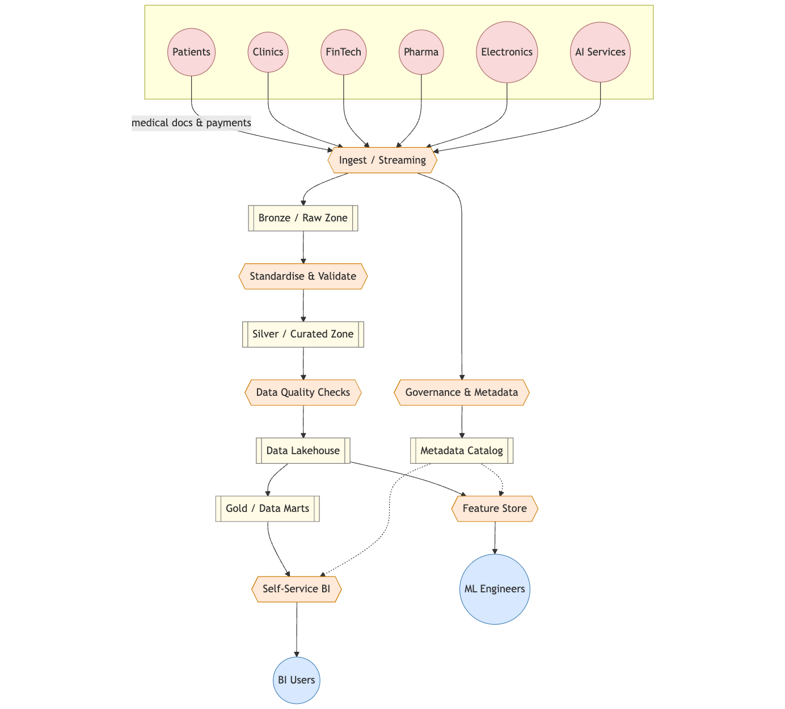

# Домены
- [Домены](#домены)
  - [Data Flow Diagram по доменам](#data-flow-diagram-по-доменам)
  - [Разбиение на домены](#разбиение-на-домены)
  - [Зачем именно такое разделение](#зачем-именно-такое-разделение)

## Data Flow Diagram по доменам
**Ключевая логика:** разделяем систему на бизнес-домены, чтобы каждая команда отвечала за свои данные, продукты и API. Это соответствует принципам Data Mesh — данные как продукт, владеют ими кросс-функциональные команды. DWH перестаёт быть центральной точкой логики

## Разбиение на домены

| № | Домен | Область ответственности | Ключевые наборы данных | Основные стейкхолдеры |
|---|-------|-------------------------|------------------------|-----------------------|
| 1 | **Клиники** | Операционная деятельность медучреждений: приём пациентов, расписания, кадры, запасы | Записи приёмов, мед-персонал, инвентарь, визиты пациентов | Мед-директора, операционные менеджеры клиник |
| 2 | **ИИ-сервисы** | ML-модели и обработка медизображений для диагностики и планирования лечения | Обработанные снимки, предсказания моделей, обучающие выборки, обратная связь | Data-scientists, радиологи |
| 3 | **Финтех** | Банковские и платёжные продукты для пациентов и партнёров | Счета, кредиты, транзакции, платёжные события | Финансовая дирекция, комплаенс-банк |
| 4 | **Фармацевтика** | Закупки, цепочка поставок и регуляторные данные по лекарствам | Каталоги препаратов, партии, SLA поставщиков, клин-исследования | Отдел закупок, регуляторный отдел |
| 5 | **Электроника / IoT** | Телеметрия и обслуживание медоборудования | Логи устройств, показатели использования, версии прошивок | Биомедицинские инженеры, IoT-DevOps |
| 6 | **Корпоративная платформа** | Сквозные сервисы: идентификация, метаданные, управление доступом | Пользователи, роли, реестр датапродуктов, политики доступа | CDO-офис, служба безопасности |
| 7 | **Аналитический домен (витрины)** | Lakehouse, data-marts, портал самообслуживания | Курированные факты и измерения, BI-дашборды, ML-фичи | BI-аналитики, бизнес-руководители |

---

## Зачем именно такое разделение

| Преимущество | Техническое обоснование | Бизнес-эффект |
|--------------|------------------------|--------------|
| **Независимое развитие** | Каждый домен владеет своей схемой, пайплайнами и SLA; изменения изолированы контрактами датапродуктов | Быстрее выводятся новые функции, нет узких мест между командами |
| **Чёткая ответственность и качество** | Команды становятся владельцами данных, пишут документацию, тесты, мониторинг | Выше доверие к отчётам, понятно к кому идти при ошибках |
| **Масштабируемое подключение новых бизнесов** | Новый актив регистрируется как домен и публикует данные через ingest-API без переписывания DWH | Быстрая интеграция покупок и партнёров, ускоренная синергия |
| **Снижение нагрузки на легаси-DWH** | Тяжёлые трансформации переносятся в Lakehouse-ELT, где compute масштабируется | Меньше лицензий/железа, отчёты выполняются быстрее |
| **Хранилище под задачу** | Lakehouse объединяет batch + stream и даёт ACID-таблицы; домены свободны выбирать форматы (Parquet/Delta/Iceberg) | Обрабатываются сотни ТБ без потери производительности |
| **Self-service аналитика** | Gold-витрины курируются один раз и переиспользуются; BI-пользователи работают без заявок к разработчикам | Решения принимаются за минуты, растёт продуктивность, снижается time-to-market |
| **Соблюдение регуляторики и безопасности** | Governance-слой централизованно применяет политики (маскирование PII, RBAC), при этом домены сохраняют видимость | Проще аудит, снижаются риски для здравоохранения и финансов |