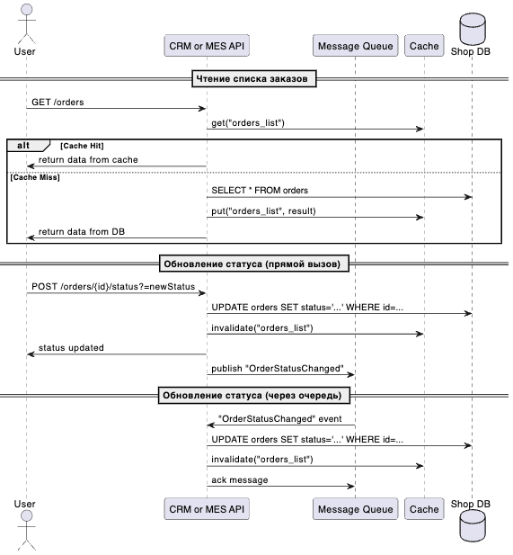

# Архитектурное решение по кешированию

- [Архитектурное решение по кешированию](#архитектурное-решение-по-кешированию)
    - [Анализ системы](#анализ-системы)
    - [Мотивация](#мотивация)
      - [Для технической команды](#для-технической-команды)
      - [Для бизнеса](#для-бизнеса)
    - [Предлагаемое решение](#предлагаемое-решение)
      - [Серверное кеширование](#серверное-кеширование)
      - [Cache-Aside](#cache-aside)
      - [Диаграмма последовательностей](#диаграмма-последовательностей)
      - [Стратегия инвалидации кеша](#стратегия-инвалидации-кеша)

### Анализ системы

1. На данный момент основным узким местом является база данных Shop DB, которую используют и Shop API, и CRM, и даже MES. Последний это делает не напрямую, но все равно использует через брокер сообщений и CRM
2. MES тоже испытывает проблемы со скоростью отображения длинных списков заказов (операторам нужно видеть новые заказы оперативно). По факту это тоже сводится к базе данных Shop DB, так как запросы просто идут не напрямую, а через брокер сообщений и CRM

Данные, которые чаще всего запрашиваются и могут быть кешированы:
1. Списки заказов для операторов в MES и для менеджеров в CRM
2. Данные о статусах заказов (непременно нужно быстро узнавать текущий статус, чтобы показывать в UI)
3. Каталог товаров (Shop) — если это не так часто изменяется, может быть выгружено в кеш

**Основная цель:** снизить нагрузку на базу и ускорить отклик фронтенд-приложений (MES, CRM, Shop).

### Мотивация

#### Для технической команды
1. Разгрузка БД: меньше повторных запросов к таблицам с заказами, особенно если у нас большие списки и неизменные данные на протяжении некоторого времени
2. Сокращение времени ответа: отдача данных из кеша быстрее, чем из основной БД, что сразу почувствуют операторы MES и менеджеры CRM
3. Упрощение архитектуры: с кешем-слоем мы можем централизованно контролировать горячие данные, например, список активных заказов

#### Для бизнеса
1. Ускорение обработки заказов: операторы перестанут жаловаться на долгую загрузку страницы, а клиенты — на затягивание этапов
2. Рост удовлетворённости: B2B-партнёры (API user) и B2C-клиенты (Shop) видят более быстрый UI; проблемы «медленного списка заказов» частично снимаются
3. Экономия: вместо постоянного масштабирования базы данных мы можем временно отложить часть затрат, оптимизировав инфраструктуру с помощью кеша

### Предлагаемое решение

#### Серверное кеширование
1. Основная нагрузка идёт на бекенды (CRM API, Shop API, MES API), которые тянут данные из одной БД
2. Поэтому серверный кеш (например, Redis или встроенный Cache в Spring Boot/.NET) позволит ускорить чтение списков заказов и частично разгрузить БД
3. Клиентский кеш (в браузере) тоже возможен, но он не так полезен при живых данных (например, часто меняющихся статусах) и не решит проблемы масштабного доступа к базе
4. Управлять данным централизованно проще на стороне сервера, так мы быстрее обновим или сбросим кеш

#### Cache-Aside
1. У нас много чтений, а записи довольно редкие
2. Мы не хотим усложнять логику синхронной записи (Write-Through), где каждая операция записи должна обновлять и кеш, и БД
3. Refresh-Ahead полезен, если мы точно знаем, что данные сильно востребованы в будущем. Но статусы заказов и их списки меняются нерегулярно — гибкость Cache-Aside тут выигрывает

#### Диаграмма последовательностей
- User (Operator/Manager): тот, кто запрашивает данные или инициирует обновление статуса
- CRM/MES API: бэкенд, в котором мы внедряем кеширование
- Message Queue (RabbitMQ): брокер сообщений, через который также могут поступать события об изменении статусов
- Cache (Redis или другой кеш): хранит ключ orders_list (и другие), чтобы разгрузить базу на чтениях
- DB (Shop DB): основная база данных заказов

**Чтение:** 
1. Пользователь (Operator/Manager) отправляет запрос GET /orders в CRM/MES API
2. Бэкенд (CRM/MES API) сначала смотрит в кеш: get("orders_list"):
  - Cache Hit: если данные найдены, сервис сразу возвращает их пользователю.
  - Cache Miss: сервис делает запрос `SELECT * FROM orders` к базе данных (Shop DB) и, получив результат, складывает его в кеш (put("orders_list", result)). Затем возвращает полученные данные пользователю

**Обновление статуса:**
1. Пользователь (Operator/Manager) вызывает POST `/orders/{id}/status?=newStatus` в CRM/MES API
2. CRM/MES API делает `UPDATE orders SET status='...' WHERE id=...` в базе данных (Shop DB)
3. После обновления записи в базе сервис выполняет `invalidate("orders_list")` в кеше, чтобы при следующем чтении списка заказов не выдать устаревшие данные
4. CRM/MES API возвращает пользователю ответ «status updated».
5. Опционально: CRM/MES API может оповестить остальные сервисы о смене статуса, публикуя событие `OrderStatusChanged` в Message Queue
   
**Логика кеширования**:
- При любом чтении списка заказов сервис (CRM/MES API) проверяет кеш (orders_list)
- При создании/изменении/удалении заказа в базе, ключ orders_list инвалидируется, чтобы следующее чтение снова обратилось к базе и обновило кеш

#### Стратегия инвалидации кеша
В контексте паттерна Cache-Aside применим комбинированный подход:
1. Программная инвалидизация (по ключу):
   - При любом изменении заказа (статуса) мы чистим (delete) соответствующий ключ из кеша, чтобы новый запрос получил свежие данные из БД

2. Временная (TTL) (опционально):
    - Можем поставить TTL (например, 5–10 минут) на orders_list. Если вдруг программная инвалидизация не сработала, устаревшие данные автоматически вымоются по истечении TTL

Почему именно такой подход:
  - Полная консистентность с БД достигается за счёт явной инвалидации ключа при записях
  - Time-To-Live создаёт дополнительную страховку, если по какой-то причине ключ не был сброшен программно

Другие стратегии (например, Refresh-Ahead или сразу Write-Through) усложнили бы реализацию и не дали существенной выгоды, учитывая непредсказуемую нагрузку и редкие записи.