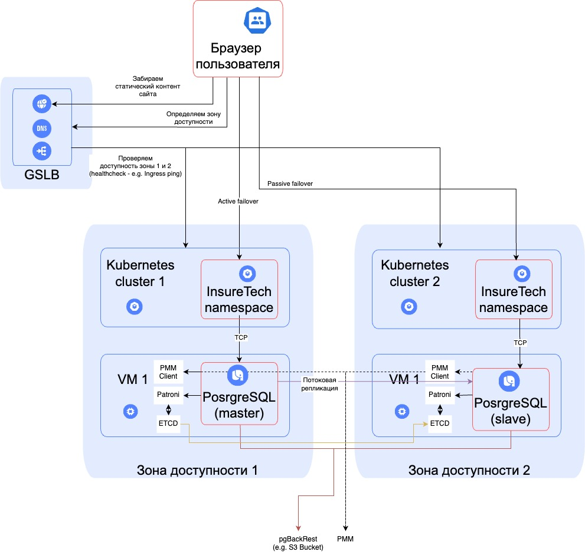

# Архитектура и обоснование решений

- [Архитектура и обоснование решений](#архитектура-и-обоснование-решений)
  - [Две зоны доступности (AZ1 и AZ2)](#две-зоны-доступности-az1-и-az2)
  - [Балансировка нагрузки (GSLB + CDN)](#балансировка-нагрузки-gslb--cdn)
  - [Фейловер-стратегия: active-passive](#фейловер-стратегия-active-passive)
  - [Конфигурация базы данных](#конфигурация-базы-данных)
  - [Масштабирование](#масштабирование)
  - [Обновленная технологическая архитекутра](#обновленная-технологическая-архитекутра)
  - [Заключение](#заключение)

## Две зоны доступности (AZ1 и AZ2)
1. В AZ1 развёрнут основной (active) Kubernetes‑кластер и master Postgres
2. В AZ2 запущен passive кластер Kubernetes (минимальный набор подов) и standby Postgres
3. Используем две независимые площадки, а не «растянутый» кластер, так как:
   - Проще поддерживать active-passive модель
   - Сбой одной зоны не сказывается на другой (изолированный control-plane)
   - CI/CD доставляет одинаковые версии приложений в обе зоны заранее, так что пассивная площадка всегда готова к быстрому failover

## Балансировка нагрузки (GSLB + CDN)
1. Global Service Load Balancer проверяет доступность зон по health-check (например, `/health`)
   - При нормальной работе отправляет весь трафик в AZ1. Если AZ1 падает, переключает на AZ2 (passive failover)
2. CDN используется для быстрой выдачи статических файлов (JS, CSS, изображения) вне зависимости от географии пользователя

## Фейловер-стратегия: active-passive
1. В обычном режиме все запросы идут в кластер и базу данных AZ1
2. Если AZ1 недоступна, `GSLB` перенаправляет трафик в AZ2
3. `Patroni` + `etcd` промотируют реплику Postgres (slave) в мастер
4. Стратегию active-active не применяем, так как:
   - PostgreSQL «из коробки» не поддерживает двухмастеровый режим без сложной логической репликации
   - Active-passive упрощает администрирование, избегает конфликтов данных и обеспечивает требуемый RTO/RPO

## Конфигурация базы данных
1. Master в AZ1, Slave (standby) в AZ2, асинхронная потоковая репликация
2. `pgBackRest` сохраняет бэкапы в S3‑совместимое хранилище, а `PMM` контролирует производительность и собирает метрики
3. Шардирование не используем, так как текущий объём (около 50 GB) легко обрабатывается одним кластером Postgres. При дальнейшем росте возможно горизонтальное разделение или партиционирование

## Масштабирование
1. Сервисы в Kubernetes используют Horizontal Pod Autoscaler (HPA). При увеличении нагрузки поднимаются новые поды на рабочих нодах. Используем HPA, а не VPA, так как HPA проще и эффективнее при всплесках трафика, легко «распараллеливает» нагрузку
2. Основные метрики для HPA:
   - Нагрузка по CPU/памяти (например, более 70% CPU на под в течение N секунд)
   - Кастомные метрики (число пользовательских запросов в минуту, длина очереди запросов, latency)
3. В перспективе возможно добавить Cluster Autoscaler для автоматического масштабирования самих нод

## Обновленная технологическая архитекутра

## Заключение

Архитектура с active-passive схемой (два независимых кластера Kubernetes, один мастер Postgres + реплика) обеспечивает:
1. **Высокую доступность** (99.99%) за счёт быстрой переключаемости между зонами
2. **Соблюдение RTO/RPO**: Patroni автоматически продвигает реплику при сбое, а асинхронная репликация даёт небольшую задержку по данным (в пределах бизнес-требований)
3. **Универсальное масштабирование**: HPA для подов, при необходимости — увеличение ресурсов БД или подключение Cluster Autoscaler
4. **Простоту администрирования**: нет двухмастеровой БД и сложного шардирования
5. **Удобную работу в регионах**: CDN ускоряет выдачу статики, GSLB определяет доступность зон и направляет трафик в активную

Решение хорошо масштабируется по горизонтали и при этом остаётся надёжным при отказе любой из зон.