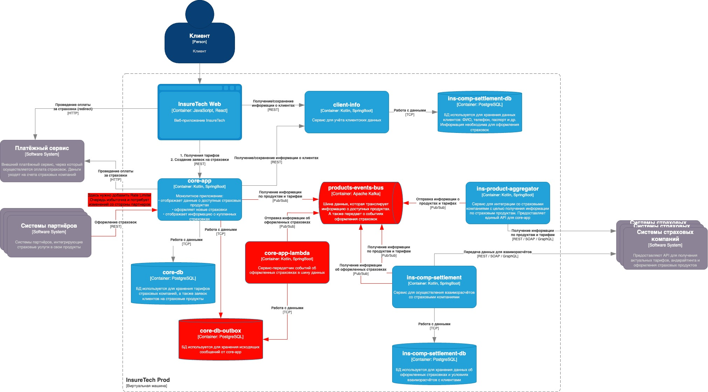

## Переход на Event-driven architecure
- [Переход на Event-driven architecure](#переход-на-event-driven-architecure)
  - [Проблемы](#проблемы)
    - [Увеличение нагрузки на core-db и бутылочное горлышко в core-app](#увеличение-нагрузки-на-core-db-и-бутылочное-горлышко-в-core-app)
    - [Рост латентности при взаимодействии core-app и ins-product-aggregator](#рост-латентности-при-взаимодействии-core-app-и-ins-product-aggregator)
    - [Перегрузка core-db ведёт к сбоям и рискам нарушения консистентности](#перегрузка-core-db-ведёт-к-сбоям-и-рискам-нарушения-консистентности)
    - [Дублирование и рассинхронизация данных о продуктах и тарифах](#дублирование-и-рассинхронизация-данных-о-продуктах-и-тарифах)
    - [Рост нагрузки со стороны B2B-партнёров и прожорливые клиенты](#рост-нагрузки-со-стороны-b2b-партнёров-и-прожорливые-клиенты)
  - [Обновленная диаграмма контейнеров](#обновленная-диаграмма-контейнеров)

### Проблемы
С учётом планируемого роста нагрузки и расширения числа партнёров компания столкнется со следюущими проблемами:

1. Увеличение нагрузки на core-db и бутылочное горлышко в core-app
2. Рост латентности при взаимодействии core-app и ins-product-aggregator
3. Перегрузка core-db ведёт к сбоям и рискам нарушения консистентности
4. Дублирование и рассинхронизация данных о продуктах и тарифах
5. Рост нагрузки со стороны B2B-партнёров и прожорливые клиенты

#### Увеличение нагрузки на core-db и бутылочное горлышко в core-app
Проблемы:
- Сегодня вся основная логика оформления страховок (и часть клиентской логики) замыкается на монолите core-app и его БД (core-db)
- С ростом числа пользователей и B2B-партнёров увеличится поток запросов (и к самому монолиту, и к БД). При пиках нагрузок это приведёт к ухудшению времени отклика и росту ошибок
- Монолит затрудняет гибкое масштабирование конкретных участков логики, а единая БД (в одном экземпляре) — узкое место по производительности и надёжности

Риски
- Дальнейшее падение SLA и потеря клиентов/партнёров
- Увеличение времени недоступности при сбоях в БД (нет реплик, нет распределения нагрузки)

Решения - **добавить очередь/шину Kafka:**
- Все критичные события (создан новый полис, обновлены данные о тарифе и т.д.) публиковать в Kafka
- Подписчики (другие сервисы) будут асинхронно получать эти события и работать со своими хранилищами

#### Рост латентности при взаимодействии core-app и ins-product-aggregator

Проблемы:
- Сейчас при каждом запросе (в т.ч. batch раз в 15 минут или раз в сутки) сервис ins-product-aggregator синхронно собирает данные от всех страховых компаний. Если список компаний (и/или продуктов) вырастет, время ответа вырастет ещё больше
- При сбое или задержке в одной из страховых систем весь вызов подвисает или падает с таймаутом. Это влияет на SLA как B2C, так и B2B

Риски:
- С ростом числа партнёрских страховых компаний (ещё 5 штук в ближайшее время) время синхронного сбора тарифов может превысить все разумные таймауты
- При увеличении объёмов данных и частоты запросов aggregator может стать точкой отказа сразу для нескольких сервисов

Решение - **Асинхронная загрузка / обновление тарифов (event-driven подход):**
- Вместо непосредственного «запроса-объединения» в реальном времени, ins-product-aggregator периодически (или по событию) обновляет у себя все тарифы из страховых компаний.
- Затем публикует событие вида NewTariffDataAvailable или TariffUpdated. Подписчики (core-app, ins-comp-settlement и т.д.) получают эти события и складывают необходимые данные к себе в кэши/реплики.
- Если действительно нужен on-demand запрос, можно отвечать уже из локального кеша (либо быстрой БД aggregator), а не «тянуть» каждый раз внешний REST

#### Перегрузка core-db ведёт к сбоям и рискам нарушения консистентности

Проблемы:
- При массовом росте запросов есть риск, что core-db не будет выдерживать транзакционные нагрузки
- Если начать вручную публиковать события о новых полисах/страховках (или обновлениях) в Kafka напрямую из приложения, то при сбоях может нарушиться консистентность (событие не успело отправиться/подтвердиться, а запись в БД уже есть)

Риски
- Появление рассинхронизации между разными хранилищами данных
- Потеря части событий или, наоборот, двойная отправка (в случае повторных транзакций)

Решение - **Transaction Outbox:**
- При записи в БД нужные события пишутся в специальную outbox-таблицу
- Затем специальный процесс/коннектор (например, Debezium) считывает их атомарно и публикует в Kafka
- Это даёт гарантированную доставку событий, синхронизированную с транзакцией в БД

#### Дублирование и рассинхронизация данных о продуктах и тарифах

Проблемы:
- core-app и ins-comp-settlement периодически тянут копии продуктовых данных у ins-product-aggregator. При сбоях (или при большом числе компаний) риск рассинхронизации увеличится
- Batch-подход (раз в 15 минут, раз в сутки) может приводить к тому, что сервисы видят устаревшие тарифы

Риски:
- Некорректный расчёт стоимости страховки (если тариф поменялся, а локальная копия устарела)
- Возможные расхождения в отчётах при расчётах со страховыми компаниями

Решение - **публикация обновлений тарифов по событию:**
- При каждом обновлении тарифа/продукта в ins-product-aggregator от внешней страховой компании публиковать событие. Остальные сервисы (core-app, settlement) подписаны и сразу получают обновление
- Кэширование на стороне потребителей
- Реализация механизма refresh и корректного TTL данных - если система всё-таки нужна онлайн, а событие ещё не дошло, иметь возможность форсировать обновление при критичных операциях

#### Рост нагрузки со стороны B2B-партнёров и прожорливые клиенты

Проблемы:
- Уже зафиксированы случаи, когда один из партнёров вместо 20 RPS дал 250 RPS и съел все ресурсы. При планируемом росте числа партнёров такие ситуации могут участиться
- Нет гибкого механизма контроля и ограничения нагрузки на общий API

Риски:
- Фактический DoS при неконтролируемых burst-запросах от B2B-клиента
- Нарушение SLA для всех партнёров и клиентов

Решение - **Rate limiting и quota management на уровне API Gateway/Load Balancer:**
- Ограничивать пиковый TPS (или RPS) партнёров, распределять нагрузку (leaky bucket, token bucket)

### Обновленная диаграмма контейнеров

Красным цветом выделены основные архитектрные изменения

