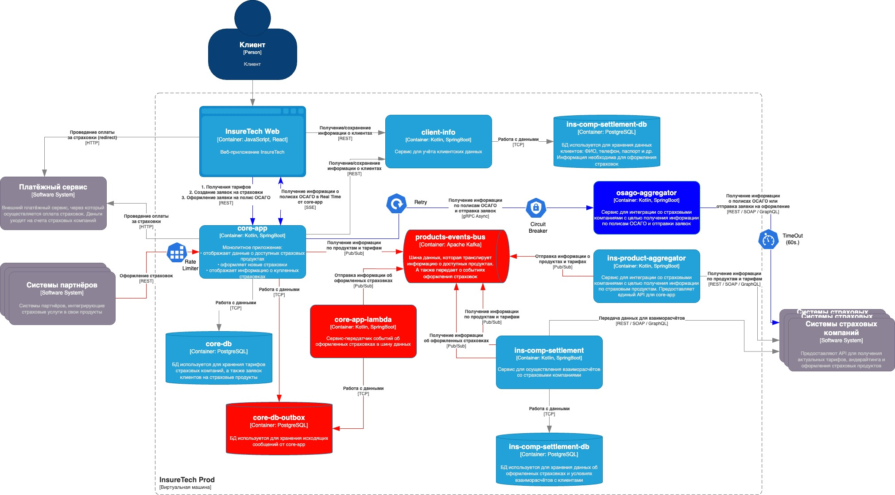

# Проектирование продажи ОСАГО
- [Проектирование продажи ОСАГО](#проектирование-продажи-осаго)
  - [Описание схемы контейнеров](#описание-схемы-контейнеров)
  - [Схема контейнеров](#схема-контейнеров)

## Описание схемы контейнеров

Веб-приложение InsureTech Web получает информацию о предложениях по полисам ОСАГО (в реальном времени) через SSE от сервиса `core-app`. При этом само оформление заявки на ОСАГО происходит по обычному REST, так как здесь не требуется мгновенная передача данных. После того как пользователь отправляет заявку в `core-app`, этот сервис асинхронно взаимодействует с `osago-aggregator`, который, в свою очередь, общается со страховыми компаниями по их REST API. Если страховая компания не даёт ответ в течение 60 секунд, соединение с ней обрывается, и пользователь просто не получает предложение от этой компании.

Чтобы не блокировать `core-app` при сбоях в агрегаторе, используется паттерн Circuit Breaker: при проблемах с osago-aggregator запросы не подвешивают работу монолита. Также добавлен механизм Retry: если один из инстансов osago-aggregator падает в процессе запроса, core-app делает повторную попытку отправить заявку (приёмлемо, поскольку агрегатор не хранит состояние заявок и не ведёт историю запросов). Для B2B-клиентов в core-app включён Rate Limiter, чтобы защитить систему от потенциальной перегрузки.

Сервис `osago-aggregator` реализован как stateless, то есть не использует собственную базу данных и не хранит долгоживущую информацию. Все необходимые данные о предложениях и ставках хранятся на стороне `core-app`, поэтому горизонтальное масштабирование агрегатора в Kubernetes (через HPA) не приводит к сложностям с синхронизацией состояния. Поскольку объём данных по заявке может быть большим, между `core-app` и `osago-aggregator` используется gRPC (streaming), обеспечивающий эффективную асинхронную передачу данных.

Идея применять Kafka в данном случае была отклонена, так как нужен именно формат команд с подтверждением результата от конкретного сервиса, а не публикация общих событий, предназначенных для множества подписчиков. Поэтому gRPC лучше подходит для точечной логики запрос–ответ (с возможностью потоковой передачи данных), а Kafka остаётся для остальных событийных взаимодействий в системе.

## Схема контейнеров

Синим цветом выделены основные архитектрные изменения для данного задания.
