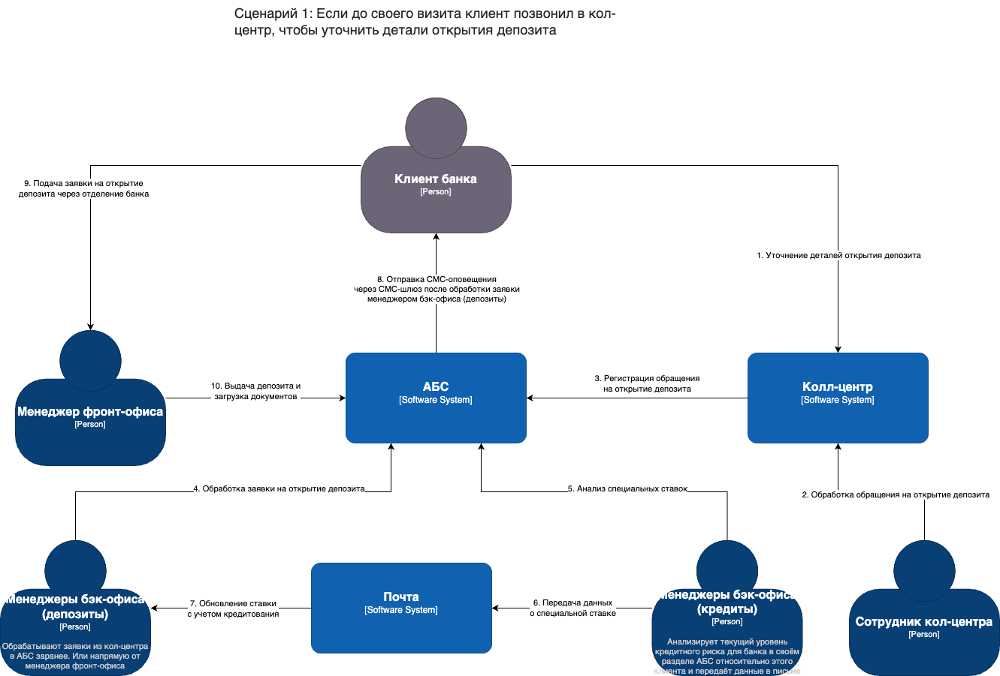
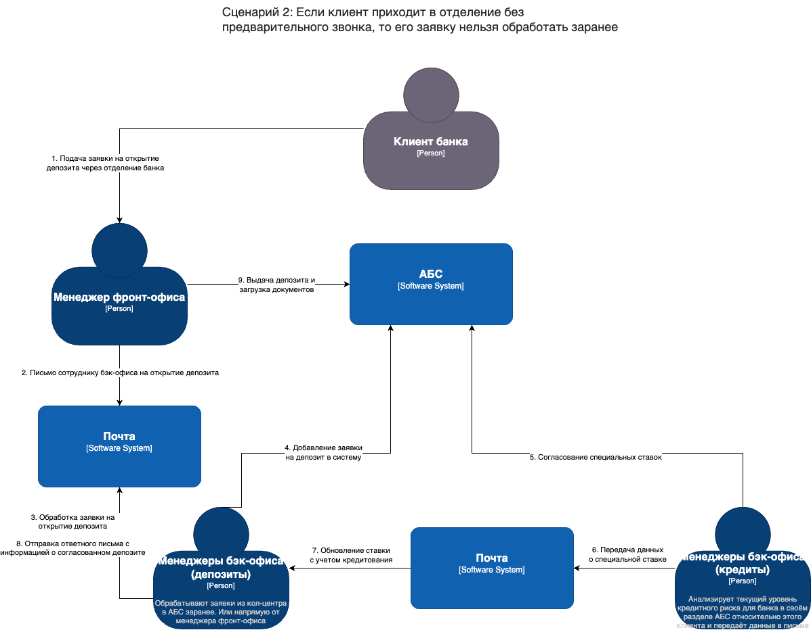

# Текущее состояние IT-ландшафта и сценарии открытия депозита

- [Текущее состояние IT-ландшафта и сценарии открытия депозита](#текущее-состояние-it-ландшафта-и-сценарии-открытия-депозита)
  - [1. Карта IT-ландшафта](#1-карта-it-ландшафта)
  - [2. Схемы интеграции (сценарии открытия депозита)](#2-схемы-интеграции-сценарии-открытия-депозита)
    - [Сценарий 1: Клиент звонит в кол-центр заранее](#сценарий-1-клиент-звонит-в-кол-центр-заранее)
    - [Сценарий 2: Клиент приходит в отделение без звонка](#сценарий-2-клиент-приходит-в-отделение-без-звонка)
  - [Ключевые моменты](#ключевые-моменты)

## 1. Карта IT-ландшафта
- **Основные бизнес-возможности** банка: 
  1. Продажи в сети отделений  
  2. Продажи через кол-центр  
  3. Digital-оповещения клиентов  
  4. Обслуживание депозитных процессов  
  5. Обслуживание кредитных процессов  
  6. Управление договорами  
- **Подразделения** (фронт-офис, бэк-офис по кредитам и депозитам, кол-центр, партнёрский кол-центр) по строкам
- **Ключевые IT-системы**, используемые каждым подразделением в рамках каждой бизнес-возможности:
  - АБС (учёт операций, бухгалтерия)
  - Система кол-центра
  - Система партнёрского кол-центра
  - Почта (для передачи Excel-файлов, коммуникаций между бэк-офисами)

| **Подразделение**          | **Продажи в сети отделений**  | **Продажи через кол-центр**        | **Digital-оповещения клиентов** | **Обслуживание депозитных процессов** | **Обслуживание кредитных процессов** | **Управление договорами** |
|----------------------------|--------------------------------|------------------------------------|---------------------------------|----------------------------------------|---------------------------------------|---------------------------|
| **Фронт-офис**             | АБС, Почта [1]                 |                                    |                                 | АБС [2]                                | АБС [3]                               | АБС [4]                  |
| **Бэк-офис (депозиты)**    | АБС, Почта [5]                 | АБС [6]                             | АБС [7]                          | АБС [8]                                |                                   | АБС [9]                  |
| **Бэк-офис (кредиты)**     |                                |                                    |                                 |                                        | АБС [10]                               | АБС [11]                 |
| **Кол-центр**              |                                | Система кол-центра [14]            |                                 | Система кол-центра [15]                | Система кол-центра [16]               |                           |
| **Партнёрский кол-центр**  |                                | Система партнёрского кол-центра [17] |                                 | Система партнёрского кол-центра [18]   | Система партнёрского кол-центра [19]  |                           |

- [1] операционное оформление счетов/вкладов, работа в отделении (взаимодействие через клиент АБС). Почта используется в случае, когда клиент банк пришел без предварительного звонка в кол-центр
- [2] ввод заявок и документов для дальнейшей обработки бэк-офисом
- [3] ввод первичных данных по кредитам, передача на бэк-офис
- [4] формируют/распечатывают проекты договоров в отделении, окончательная версия в бэк-офисе
- [5] проверка открытых в отделении вкладов (учёт, расчёты). Почта используется в случае, когда клиент банк пришел без предварительного звонка в кол-центр
- [6] при обращениях от кол-центра (удалённые клиенты), проверка и расчёты вкладов
- [7] возможна генерация уведомлений клиентам о статусе вкладов (иногда через интернет-банк)
- [8] основная система учёта депозитов, расчёт процентов, оформление доп. соглашений
- [9] генерация депозитных договоров, хранение и учёт
- [10] если кол-центр собрал предварительные заявки, бэк-офис проверяет и выдаёт решения
- [11] уведомления по кредитным заявкам (одобрение/отказ и т.п.)
- [12] основная система учёта кредитов, расчёт процентов, сопровождение сделок
- [13] генерация кредитных договоров, учёт, хранение
- [14] базовый инструмент для телефонных продаж (входящие/исходящие звонки)
- [15] (заявки на депозиты) + передача данных в АБС
- [16] (заявки на кредиты) + передача данных в АБС
- [17] внешний инструмент, обзвоны по депозитам/кредитам
- [18] сбор заявок, передача в банк (бэк-офис)
- [19] сбор заявок, передача в банк (бэк-офис)

> В таблице показано, какая система нужна конкретному подразделению для реализации определённой возможности. Например, «Фронт-офис» для «Продаж в сети отделений» использует **АБС** и **Почту**, а "Кол-центр" для "Продаж через кол-центр" — **Систему кол-центра**

## 2. Схемы интеграции (сценарии открытия депозита)

### Сценарий 1: Клиент звонит в кол-центр заранее
1. **Клиент** уточняет детали вклада по телефону
2. **Сотрудник кол-центра** регистрирует обращение в **Системе кол-центра**, которое затем передаётся в **АБС**
3. **Менеджеры бэк-офиса (депозиты)** видят заявку в **АБС** и рассчитывают ставку. При необходимости запрос по «спецставке» согласуется с **кредитным бэк-офисом** (данные передаются по **Почте**)
4. Итоговая ставка фиксируется в **АБС**; автоматически формируется **СМС** для клиента
5. **Клиент** приходит в отделение, **Фронт-офис** оформляет депозит (через **АБС**) и выдаёт документы

### Сценарий 2: Клиент приходит в отделение без звонка
1. **Клиент** подаёт заявку прямо в офисе
2. **Фронт-офис** пишет письмо в **бэк-офис (депозиты)** (через **Почту**), чтобы запросить или рассчитать ставку
3. **Менеджеры бэк-офиса (депозиты)** оформляют заявку в **АБС**; если нужна «спецставка», делают запрос в **бэк-офис (кредиты)** (обмен данными по **Почте**)
4. После согласования ставки **бэк-офис (депозиты)** присылает её обратно **Фронт-офису**
5. **Фронт-офис** создает вклад в **АБС**, выдаёт клиенту документы и загружает подписанные документы обратно в систему

> В обоих сценариях **АБС** является центральной системой учёта и формирования договоров, а бэк-офис депозитов и кредитов обмениваются деталями по **Почте**, в частности Excel-файлами со ставками и информацией о рисках

## Ключевые моменты
1. АБС — главная учётная система (операции, договоры)
2. Система кол-центра — принимает входящие/исходящие звонки и передаёт заявки в АБС
3. Почта — используется для согласования «специальных ставок» и обмена Excel-файлами между бэк-офисами (депозиты / кредиты)
4. Система партнёрского кол-центра — внешняя система, используется для аутсорсинговых звонков (пока не задействована в открытии депозитов, но фигурирует в карте IT-ландшафта)