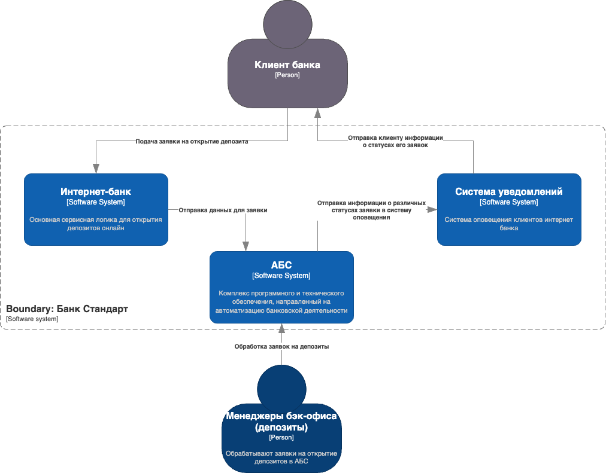
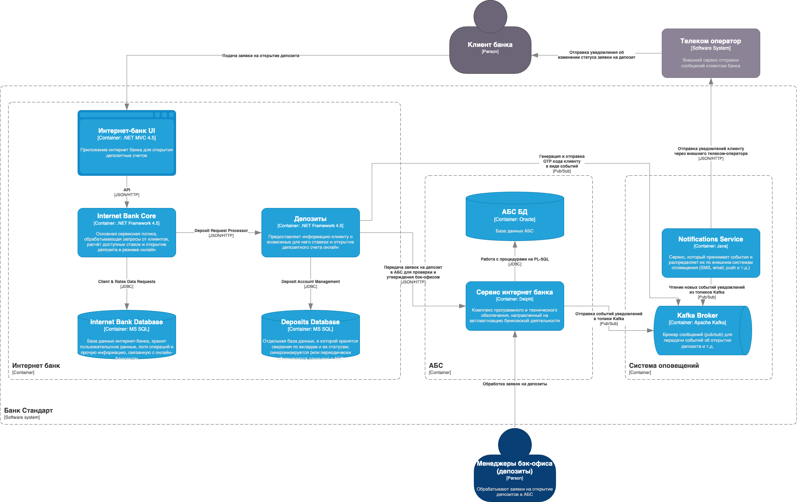

# Архитектурное решение (ADR)

- [Архитектурное решение (ADR)](#архитектурное-решение-adr)
    - [Название задачи](#название-задачи)
    - [Автор](#автор)
    - [Дата](#дата)
  - [Функциональные требования](#функциональные-требования)
  - [Нефункциональные требования](#нефункциональные-требования)
  - [Решение](#решение)
    - [Диаграмма контекста](#диаграмма-контекста)
    - [Диаграмма контейнеров](#диаграмма-контейнеров)
    - [Альтернативы](#альтернативы)
    - [Недостатки, ограничения, риски](#недостатки-ограничения-риски)

### Название задачи
MVP цифровизации открытия депозитов (только для действующих клиентов через Интернет-банк)

### Автор
Степанов Николай (Архитектор)

### Дата
26.03.2025

---

## Функциональные требования

В MVP фокусируемся лишь на действующих клиентах, которые пользуются интернет-банком. Ниже описаны ключевые Use Cases:

| **№** | **Действующие лица / системы**            | **Use Case**                                                     | **Описание**                                                                                                                                                                           |
|:----:|:-------------------------------------------|:-----------------------------------------------------------------|:----------------------------------------------------------------------------------------------------------------------------------------------------------------------------------------|
| 1    | Клиент (действующий), Интернет-банк (ИБ)   | Просмотр доступных депозитов и подача заявки                     | Авторизованный клиент видит свои персонализированные ставки, выбирает счёт-источник, сумму депозита и инициирует заявку на открытие вклада.                                            |
| 2    | Интернет-банк, Сервис SMS                  | Подтверждение операции через SMS                                 | Система запрашивает у клиента ввод SMS-кода. При успешном вводе заявка фиксируется во вновь созданном сервисе (прослойке), затем передаётся в АБС для обработки.                       |
| 3    | Менеджер бэк-офиса (депозиты), АБС         | Рассмотрение заявки и подтверждение условий депозита             | На этапе MVP менеджер бэк-офиса вручную рассчитывает или утверждает ставку (если требуется уточнение) и подтверждает депозит в АБС.                                                    |
| 4    | АБС, Сервис SMS, Клиент                    | Уведомление клиента об открытии депозита                         | После подтверждения вклада в АБС система (или промежуточный сервис) отправляет SMS клиенту. Статус заявки обновляется в интернет-банке.                                               |

> Примечание:  
> - Ставки по депозитам по-прежнему могут храниться в XLS, но в планах — реализовать модуль ведения ставок внутри АБС.  
> - Для MVP нет сценария «нового клиента», соответственно, сайт и кол-центр остаются вне рассмотрения.

---

## Нефункциональные требования

Ниже перечислены ключевые нефункциональные и архитектурно значимые требования, которые остаются в силе и применяются в контексте работы интернет-банка:

| **№** | **Требование**                                                                                                                                                                  |
|:----:|:---------------------------------------------------------------------------------------------------------------------------------------------------------------------------------|
| 1    | Круглосуточная работа (24/7) с доступностью не менее 99,9%. При сбоях необходимо обеспечить переключение на резервный ЦОД (хотя интернет-банк пока не полностью это поддерживает) |
| 2    | Использовать имеющиеся технологии в банке (Oracle, MS SQL, Java/.NET). Если потребуется асинхронный обмен (например, массовые уведомления). Добавить Kafka в качестве шины данных для различных типов уведомлений |
| 3    | Исключить прямую работу интернет-банка с базой АБС, чтобы не перегружать АБС (она уже на пределе). Создать промежуточный сервис, способный горизонтально масштабироваться        |
| 4    | Шифровать трафик (HTTPS/TLS) между клиентом и интернет-банком, а также между сервисом интернет-банка и новым промежуточным сервисом (при обмене данными)                         |
| 5    | Добиваться отклика ≤ 1 сек при подаче заявки, используя балансировку нагрузки и горизонтальное масштабирование новых сервисов (АБС масштабируется лишь вертикально)              |
| 6    | Обеспечить доработку SMS-функционала силами внутренней команды, минимизируя зависимость от подрядчика                                                                            |
| 7    | Обеспечить разграничение данных: у сотрудников депозитов и кредитов должна быть своя зона в АБС (регламент безопасности)                                                        |
| 8    | Документировать все новые модули и API для облегчения дальнейших доработок и автоматизации расчёта ставок в будущем                                                             |

---

## Решение

Ниже представлены диаграммы в стиле C4 (уровни контекста и контейнеров) и пояснение, как они удовлетворяют функциональным и нефункциональным требованиям.

### Диаграмма контекста

### Диаграмма контейнеров

Обоснование выбора решений:
1. Контейнер Deposits
    - Создаётся как отдельный модуль внутри интернет-банка, который обрабатывает логику открытия вкладов (расчёт доступных ставок, формирование заявок). Он обращается к АБС посредством REST/HTTP-запросов, тем самым разгружая АБС от прямых вызовов и обеспечивая горизонтальное масштабирование на стороне .NET

2. Интернет-банк
   - Работает на существующей платформе .NET (ASP.NET MVC для фронтенда, .NET Framework для бэкенда). Deposits встроен в общую экосистему интернет-банка, но выделен как самостоятельный контейнер, чтобы его можно было масштабировать и развивать независимо. Прямого доступа к базе АБС нет — все операции идут через HTTP/JSON к Deposits, который затем синхронизируется с АБС

3. Сервис нотификаций + Kafka
    - Для асинхронной отправки уведомлений (SMS, email, push) используется Notifications Service на Java. Он читает события из Kafka Broker, куда Deposits и АБС публикуют информацию о статусах заявок. Использование Kafka даёт гибкость и надёжность в доставке уведомлений и позволяет расширять каналы оповещений без изменения основного кода интернет-банка

4. АБС
    - Остаётся центральной системой учёта (Delphi-клиент + Oracle БД). Вертикально масштабировать её затратно, поэтому основные запросы снаружи идут через Deposits, который кэширует или аккумулирует данные, снижая нагрузку на АБС. Менеджеры бэк-офиса (депозиты) продолжают работать в АБС, утверждая и обрабатывая заявки
  
5. Технологии
   - .NET (C#/ASP.NET MVC) для интернет-банка, Java (Spring) для сервисов уведомлений, MS SQL для хранения данных интернет-банка и вкладов (Deposits Database), Oracle для АБС. Kafka (Apache Kafka) используется как broker/pub-sub для межсервисного взаимодействия по событиям изменения статуса заявок

### Альтернативы

1. Прямое подключение интернет-банка к АБС
   - Недостатки: риск перегрузки базы АБС, сложнее масштабировать, противоречит требованиям по доступности 24/7 и раздельному доступу
   - Риски: отказ в масштабировании, сбои АБС от избыточных запросов
2. Внешний подрядчик для SMS/уведомлений
   - Недостатки: зависимость от внешней команды, дополнительные расходы, сложность интеграции и SLA
   - Риск: потеря контроля над критичным функционалом (уведомления), задержки при доработках
3. Продолжение хранения ставок только в Excel
   - Недостатки: ручная пересылка файлов, риск ошибок, нет прозрачности, трудно масштабировать процесс
   - Риск: несогласованные версии ставок, задержки в обслуживании клиентов

### Недостатки, ограничения, риски

Недостатки:
   - Разработка и встраивание Deposits в интернет-банк требуют времени и согласования со старыми компонентами .NET Framework
   - АБС остаётся монолитной, масштабирование только вертикальное. При резком росте нагрузки на депозиты придётся искать дополнительные оптимизации

Ограничения:
   - Бэк-офис депозиты и кредиты по-прежнему разделены, поэтому часть согласований (например, спецставки) остаётся ручной до внедрения новой логики в АБС
   - Интернет-банк ограничен .NET Framework, а Kafka — на Java, что требует аккуратной интеграции

Риски:
   - При большом потоке клиентов придётся оперативно масштабировать Deposits и сервис уведомлений, а также следить, чтобы АБС не вышла на предельную загрузку
   - Internet-банк может не обеспечивать полную отказоустойчивость (99,9%) прямо сейчас; переключение на резервный ЦОД не полностью автоматизировано, что потенциально ведёт к простоям