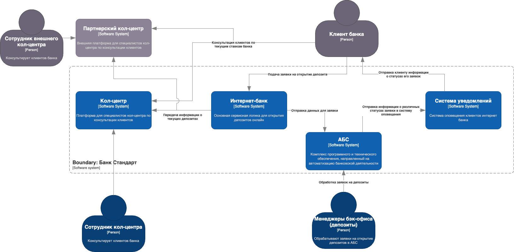
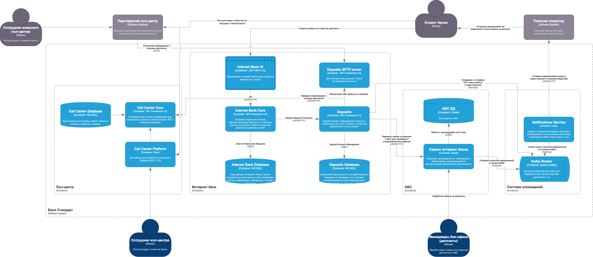

# Архитектурное решение (ADR)

- [Архитектурное решение (ADR)](#архитектурное-решение-adr)
    - [Название задачи](#название-задачи)
    - [Автор](#автор)
    - [Дата](#дата)
  - [Функциональные требования](#функциональные-требования)
  - [Нефункциональные требования](#нефункциональные-требования)
  - [Решение](#решение)
    - [Диаграмма контекста](#диаграмма-контекста)
    - [Диаграмма контейнеров](#диаграмма-контейнеров)
      - [Обоснование выбора решений](#обоснование-выбора-решений)
  - [Альтернативы](#альтернативы)
  - [Недостатки, ограничения, риски](#недостатки-ограничения-риски)
    - [Недостатки](#недостатки)
    - [Ограничения](#ограничения)
    - [Риски](#риски)

### Название задачи
Расширение MVP для подключения кол-центров к актуальным ставкам

### Автор
Степанов Николай (Архитектор)

### Дата
27.03.2025

---

## Функциональные требования

Ниже приведены ключевые Use Cases, которые были добавлены к MVP в связи с необходимостью информировать внутренний и партнёрский кол-центр об актуальных депозитных ставках:

| **№** | **Действующие лица / системы**                              | **Use Case**                                                                                           | **Описание**                                                                                                                                                                                                        |
|:----:|:-------------------------------------------------------------|:-------------------------------------------------------------------------------------------------------|:---------------------------------------------------------------------------------------------------------------------------------------------------------------------------------------------------------------------|
| 1    | Клиент банка, Интернет-банк                                  | Открытие депозита (MVP‐процесс)                                                                         | Действующий клиент входит в интернет-банк и подаёт заявку на депозит. Система Deposits обрабатывает заявку и передаёт её в АБС на утверждение                                                                                                         |
| 2    | Клиент банка, Внутренний кол-центр (Call Center Core)        | Получение консультации по ставкам (внутренний кол-центр)                                               | Сотрудник внутреннего кол-центра запрашивает актуальные ставки через API Deposits. Информацию об особых условиях (спецставках) также получают из Deposits (нет прямого доступа к АБС)                                                             |
| 3    | Клиент банка, Партнёрский кол-центр                          | Получение консультации по ставкам (внешний кол-центр)                                                  | Партнёрский кол-центр не интегрирован по API, поэтому получает файл со ставками (CSV/XML) с SFTP‐сервера. После скачивания эти данные используются для консультаций клиентов                                                                            |
| 4    | Deposits, SFTP-сервер, Партнёрский кол-центр                 | Регулярная выгрузка файлов со ставками                                                                 | Deposits по расписанию формирует и выгружает файл со ставками на SFTP. Партнёрский кол-центр скачивает файл и обновляет у себя справочник ставок                                                                                                      |
| 5    | Менеджеры бэк-офиса (депозиты), АБС                          | Утверждение новых депозитов и ручная корректировка ставок                                              | Бэк-офис депозитов работает в АБС, однако актуальные ставки синхронизируются в Deposits, чтобы кол-центры (внутренний и внешний) могли получать эти данные без прямого доступа к АБС                                                                 |

---

## Нефункциональные требования

С учётом расширения MVP для кол-центров, дополнительно появляются архитектурно значимые требования:

| **№** | **Требование**                                                                                                                         |
|:----:|:----------------------------------------------------------------------------------------------------------------------------------------|
| 1    | **Безопасность и консистентность**: у внутренних операторов и у партнёрского кол-центра должны быть одинаково актуальные данные о ставках. Deposits — единая точка истины |
| 2    | **Никакого прямого доступа к АБС**: кол-центры (внутренний и партнёрский) не могут обращаться к АБС напрямую. Всё идёт через Deposits (API либо SFTP)                  |
| 3    | **Обновление ставок по расписанию**: выгрузка на SFTP должна осуществляться не реже раза в сутки (или по событию). Внутренний КЦ видит обновления через API сразу        |
| 4    | **Минимальная нагрузка на АБС**: Deposits должен кэшировать / хранить ставки, чтобы не делать избыточных запросов к АБС                                                  |
| 5    | **Доступность**: решение должно выдерживать пиковую нагрузку (массовые звонки). Не допускается, чтобы кол-центр или интернет-банк не работали из-за перегрузки           |
| 6    | **Шифрование и разграничение**: SFTP-сервер защищён, внешнему кол-центру выдаются только файлы со ставками, без клиентских данных                                          |

---

## Решение

В основе решения лежит идея выгружать актуальные депозитные ставки в единый источник (SFTP-сервер) для внешнего кол-центра и обеспечивать онлайн-доступ к ставкам для внутреннего кол-центра через сервисную прослойку, не напрямую к АБС 

### Диаграмма контекста

### Диаграмма контейнеров

#### Обоснование выбора решений

1. **Система Deposits** как модуль интернет-банка является единственной точкой для хранения / кэширования ставок
2. **Внутренний кол-центр** запрашивает ставки через REST API «Deposits» (операторы видят актуальную информацию без обращения к АБС)
3. **Партнёрский кол-центр** получает файл через SFTP (CSV/XML), выгружаемый Deposits по расписанию
4. **Бэк-офис депозитов** продолжает вручную корректировать ставки в АБС, но Deposits регулярно синхронизируется с АБС, обеспечивая единое актуальное значение ставок для всех каналов
5. **Безопасность** достигается с помощью шифрованных соединений (HTTPS, SFTP) и разграничения доступа (внешний кол-центр видит только файл со ставками)

---

## Альтернативы

1. **Прямое API для партнёрского кол-центра**  
   - Недостатки: партнёр не готов к API; требует дополнительной интеграции и соглашения по безопасности (VPN/IP whitelist)
2. **Отправлять Excel-файлы по email**  
   - Недостатки: ручной процесс, риск потери писем, нет автоматического обновления
3. **Подключить кол-центры напрямую к АБС**  
   - Недостатки: повышенная нагрузка на АБС, не соответствует требованиям безопасного разграничения

---

## Недостатки, ограничения, риски

### Недостатки
- Партнёрский кол-центр получит информацию с задержкой (согласно расписанию выгрузок)
- Нужно доработать Deposits (API для внутреннего КЦ, модуль выгрузки для партнёрского), что требует времени

### Ограничения

- Запрещён прямой доступ кол-центров к АБС, чтобы не перегрузить её и сохранить безопасность
- Файлы на SFTP не содержат персональных данных о клиентах, лишь ставки

### Риски

- Если массово меняются ставки, возникает повышенная нагрузка на Deposits (частые выгрузки)
- Нарушение расписания выгрузок — партнёрский кол-центр может консультировать клиентов по устаревшим ставкам
- При пиковых звонках нужно обеспечить масштабирование кол-центра и Deposits, чтобы избежать задержек