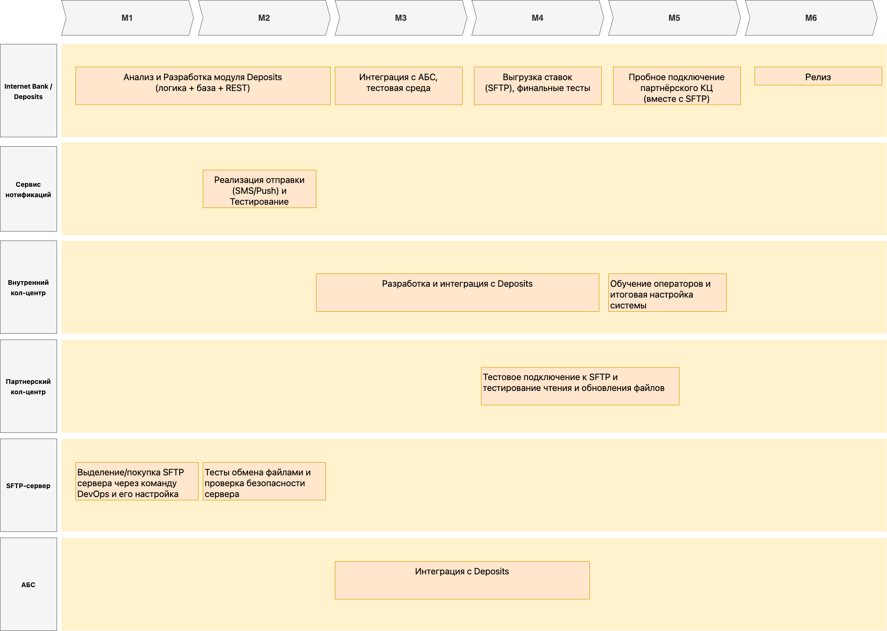

# Планирование запуска MVP продукта

- [Планирование запуска MVP продукта](#планирование-запуска-mvp-продукта)
  - [Перечень крупных задач](#перечень-крупных-задач)
  - [RoadMap на 6 месяцев](#roadmap-на-6-месяцев)

## Перечень крупных задач

| **Система**                 | **Задача**                                                                               | **Оценка по времени** | **Команда**                            | **Технологии**                                      |
|-----------------------------|-------------------------------------------------------------------------------------------|-----------------------|----------------------------------------|------------------------------------------------------|
| **Internet Bank / Deposits**| 1. Создать модуль Deposits (логика открытия депозитов, расчёт и хранение ставок)        | ~2–3 мес.            | Разработчики интернет-банка            | .NET (C#), MS SQL, REST/JSON                         |
|                             | 2. Реализовать интеграцию с АБС (создание заявок, подтверждение депозитов)               | ~1 мес.              | Та же команда                          | .NET (C#), Oracle (через REST/сервисный слой)        |
|                             | 3. Разработать REST API для внутренних кол-центров (список ставок, чтение заявок)         | ~1 мес.              | Та же команда                          | ASP.NET / .NET API                                   |
|                             | 4. Реализовать выгрузку ставок на SFTP для партнёрского кол-центра (CSV/XML)             | ~1 мес.              | Та же команда                          | .NET (C#) + SFTP                                     |
| **Сервис нотификаций**      | 1. Настройка отправки SMS/уведомлений при открытии депозита                              | ~2 нед.              | Команда нотификаций (Java)             | Java (Spring), Kafka (если используется)            |
| **Внутренний кол-центр**    | 1. Интеграция с Deposits API для получения ставок                                        | ~1 мес.              | Разработчики кол-центра                | .NET (C#) или Java, в зависимости от платформы КЦ    |
|                             | 2. Обновление UI и скриптов: операторы видят актуальные ставки, могут консультировать     | ~1 мес.              | Команда кол-центра                     | Зависит от текущего стека (CRM, .NET, и т. д.)       |
| **Партнёрский кол-центр**   | 1. Подключение к SFTP, обучение персонала пользоваться выгрузкой                         | ~2 нед.              | Команда партнёра                        | SFTP-клиент                                         |
|                             | 2. Обновление внутренних инструкций и форматов чтения файлов                             | ~2 нед.              | Команда партнёра                        | Работа с CSV/XML                                    |
| **SFTP-сервер**             | 1. Настроить безопасную директорию/аккаунт, предоставить доступ партнёру                  | ~2 нед.              | DevOps / Infra                          | Linux/Windows + OpenSSH / SFTP                      |
| **АБС**                     | 1. Дооптимизировать схему: корректное отражение ставок, приём заявок                      | ~1 мес.              | Команда АБС                             | PL/SQL, Oracle                                      |
|                             | 2. Подготовить API/процедуры для интеграции с Deposits (при необходимости)               | ~2 нед.              | Та же команда                           | Delphi / Oracle                                     |

## RoadMap на 6 месяцев

**Расшифровка**:
- **М1**: Начало проекта, сбор требований, проектирование ключевых модулей (Deposits, кол-центр API, SFTP)
- **М2—М3**: Основная разработка и интеграция. Тестирование Deposits с АБС, создание выгрузки ставок, настройка уведомлений
- **М4—М5**: Подключение партнёрского кол-центра (SFTP), обучение персонала, пилотный запуск. Кол-центр банка настраивает скрипты (API)
- **М6**: Окончательный релиз MVP, оформление депозитов через ИБ работает, кол-центры (внутренний и внешний) консультируют по ставкам

Таким образом, к концу 6-го месяца:
- Клиент (действующий) может открыть депозит/накопительный счёт онлайн (через интернет-банк)
- Бэк-офис обрабатывает заявку по старому процессу (ручной расчёт или согласование)
- Оба кол-центра получают актуальные ставки (внутренний — по API, внешний — через SFTP)